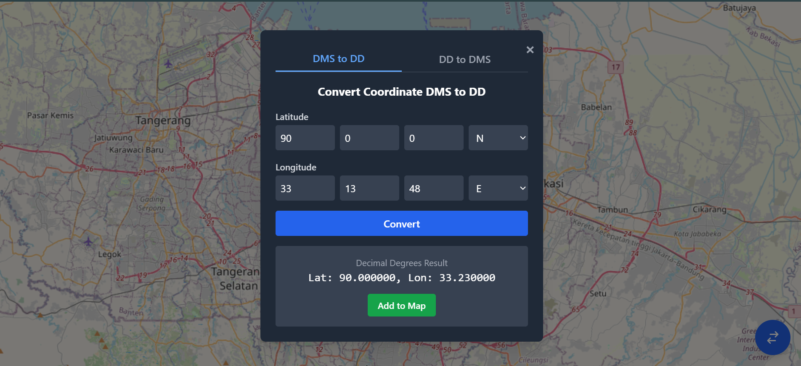
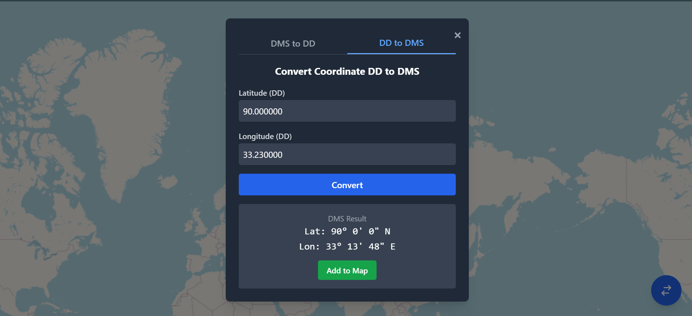
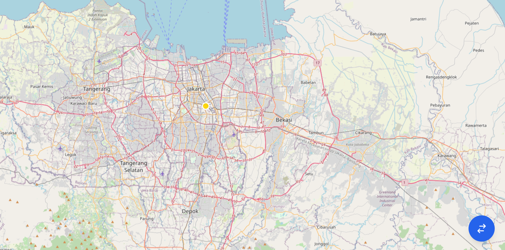

# 🗺️ PT Len IoTi - Tes Frontend Developer: Peta Konverter Koordinat

<div align="center">
  
  
  
  
  
</div>

---

## 👨‍💻 Informasi Candidate

**Nama**: Fredli Fourqoni  
**Posisi**: Frontend Developer - PT Len Inovasi Teknologi  
**Tujuan**: Aplikasi web pemetaan interaktif sebagai bagian dari proses seleksi magang

---

## 🎯 Tentang Aplikasi

Aplikasi web pemetaan interaktif yang memungkinkan pengguna melakukan konversi koordinat geografis dua arah antara format **DMS (Degrees, Minutes, Seconds)** dan **DD (Decimal Degrees)**, dengan visualisasi real-time pada peta interaktif.

---

## ✨ Fitur Utama

### 🗺️ **Peta Interaktif**
Menampilkan peta dasar dari OpenStreetMap menggunakan library OpenLayers dengan kontrol navigasi yang lengkap.

### 🔄 **Konversi Dua Arah**
Form intuitif dengan tab switching untuk:
- **DMS → DD**: Konversi dari format Derajat, Menit, Detik ke Desimal
- **DD → DMS**: Konversi dari format Desimal ke Derajat, Menit, Detik

### 📍 **Visualisasi Marker**
Penambahan marker otomatis pada peta sesuai dengan koordinat hasil konversi dengan animasi smooth.

### 💎 **Antarmuka Modern**
UI yang bersih, responsif, dan user-friendly dengan:
- Design system yang konsisten
- Responsive layout untuk berbagai device
- Smooth transitions dan animations

### 🧪 **Teruji & Reliable**
Logika konversi inti telah diverifikasi menggunakan comprehensive unit testing dengan Jest.

---

## 📸 Preview Aplikasi

| DMS to DD Conversion | DD to DMS Conversion |
|:---:|:---:|
|  |  |

<div align="center">
  
  <br>
  <em>Tampilan marker yang ditambahkan ke peta secara real-time</em>
</div>

---

## 🛠️ Stack Teknologi

<table>
  <tr>
    <td><strong>Frontend Framework</strong></td>
    <td>ReactJS dengan TypeScript</td>
  </tr>
  <tr>
    <td><strong>Styling Framework</strong></td>
    <td>Tailwind CSS</td>
  </tr>
  <tr>
    <td><strong>Map Library</strong></td>
    <td>OpenLayers </td>
  </tr>
  <tr>
    <td><strong>Build Tool</strong></td>
    <td>Vite </td>
  </tr>
  <tr>
    <td><strong>Testing Framework</strong></td>
    <td>Jest & ts-jest</td>
  </tr>
  <tr>
    <td><strong>Package Manager</strong></td>
    <td>npm/yarn</td>
  </tr>
</table>

---

## 📂 Struktur Proyek

```
src/
├── components/                 # 🧩 Komponen UI React
│   ├── ConversionForm/
│   │   └── ConversionForm.tsx # 📝 Komponen modal form konversi
│   └── Map/
│       └── MapContainer.tsx   # 🗺️ Komponen peta dan marker
│
├── utils/                     # 🔧 Kumpulan fungsi bantuan
│   ├── coordinateConverter.ts     # ⚙️ Logic konversi DMS ↔ DD
│   └── coordinateConverter.test.ts # 🧪 Unit test logic konversi
│
├── App.tsx                    # 🏠 Komponen utama & state management
├── index.css                  # 🎨 File CSS global & Tailwind setup
└── main.tsx                   # 🚀 Entry point aplikasi React
```

---

## 🧮 Algoritma Konversi

### DMS ke DD
```typescript
DD = Degrees + (Minutes / 60) + (Seconds / 3600)
```

### DD ke DMS
```typescript
Degrees = floor(DD)
Minutes = floor((DD - Degrees) * 60)
Seconds = ((DD - Degrees) * 60 - Minutes) * 60
```
## Instalasi dan Cara Menjalankan Proyek

1.  **Clone repository ini:**
    ```bash
    git clone https://github.com/fredli4qooni/len-ioti-test.git
    ```

2.  **Masuk ke direktori proyek:**
    ```bash
    cd len-ioti-test
    ```

3.  **Install semua dependencies:**
    ```bash
    npm install
    ```

4.  **Menjalankan aplikasi di mode pengembangan:**
    Perintah ini akan menjalankan aplikasi di `http://localhost:5173` (atau port lain yang tersedia).
    ```bash
    npm run dev
    ```

5.  **Menjalankan unit tests:**
    Perintah ini akan menjalankan semua file tes menggunakan Jest.
    ```bash
    npm run test
    ```
---

## 📞 Kontak

**Fredli Fourqoni**  
Frontend Developer Candidate  
📧 Email: [fredlifourqoni9@gmail.com]  

---

<div align="center">
  <p><em>Copyright © 2024 Fredli Fourqoni. All rights reserved.</em></p>
</div>
